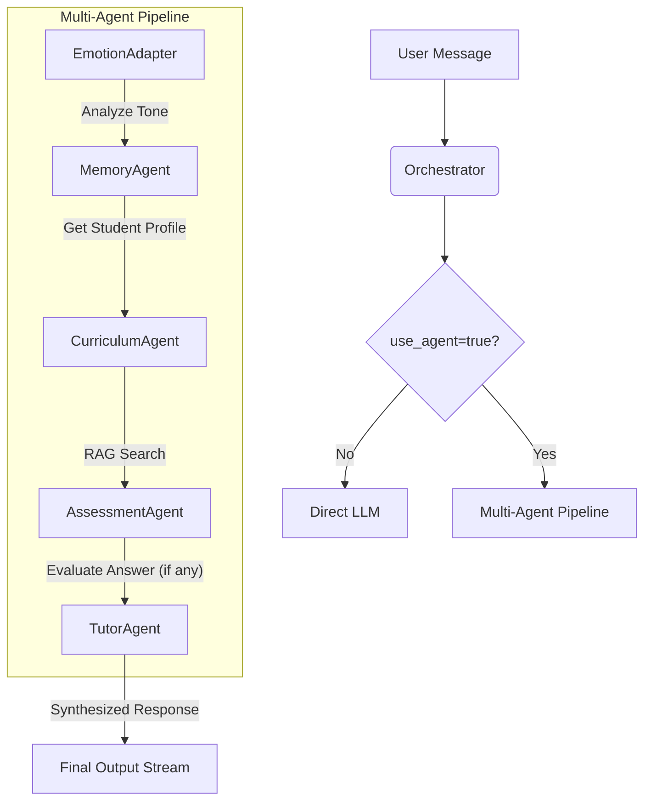

# Multi-Agent Orchestration Flow (Phase 3)

Luồng xử lý đa Agent trong NovaTutor AI được thiết kế để cá nhân hóa tối đa trải nghiệm học tập bằng cách phối hợp nhiều chuyên gia AI.

## 1. Sơ đồ luồng (Orchestrator Flow)

## 2. Các Agent và Vai trò

| Agent | Vai trò | Công cụ chính |
| :--- | :--- | :--- |
| **EmotionAdapter** | Phân tích trạng thái cảm xúc & đề xuất tông giọng. | `analyze_sentiment` |
| **MemoryAgent** | Quản lý hồ sơ sinh viên & ngữ cảnh dài hạn. | `get_student_context`, `update_student_profile` |
| **CurriculumAgent** | Chuyên gia nội dung học tập (RAG). | `search_curriculum` |
| **AssessmentAgent** | Đánh giá câu trả lời & chấm điểm hiểu bài. | `evaluate_answer` |
| **TutorAgent** | Gia sư chính, tổng hợp thông tin & tương tác. | `calculate`, `knowledge_lookup` |

## 3. Hệ thống phân quyền công cụ (Tool Policy)

Chúng tôi triển khai lớp `ToolPolicyLayer` để đảm bảo mỗi Agent chỉ có quyền truy cập vào các công cụ nằm trong phạm vi chuyên môn của mình, tăng cường tính an toàn và bảo mật.

## 4. Khả năng truy vết (Traceability)

Mỗi phiên hội thoại đa Agent được gắn một `internal_session_id` (UUID) duy nhất. Các bước xử lý của Agent được log lại để phục vụ việc gỡ lỗi và phân tích hiệu quả sư phạm.
