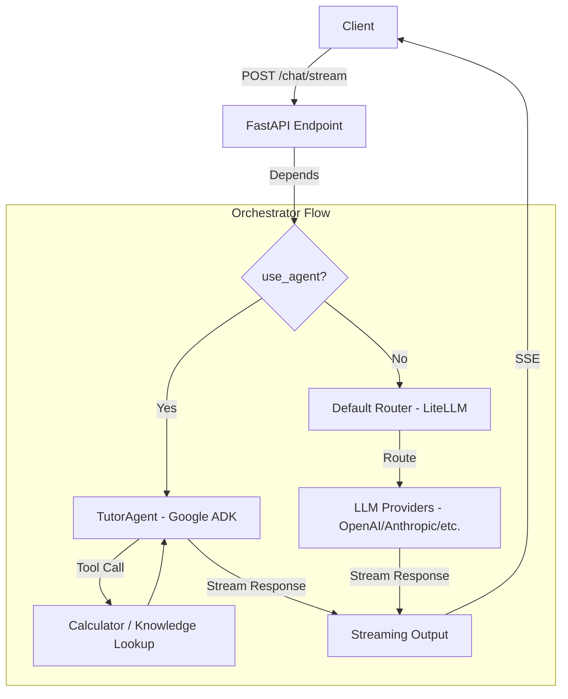

### NovaTutor Orchestrator Flow (Stage 1)

#### Các thành phần chính:
1. **LiteLLM Provider**: Đóng vai trò là model router, cho phép chuyển đổi linh hoạt giữa các LLM providers (OpenAI, Anthropic, Gemini) mà không thay đổi code logic.
2. **TutorAgent (Google ADK)**: Agent chuyên biệt cho giáo dục, hỗ trợ gọi hàm (function calling) để thực hiện tính toán và tra cứu kiến thức.
3. **Tools**: 
   - `calculator`: Thực hiện các phép tính toán học.
   - `knowledge_lookup`: Tra cứu thông tin từ cơ sở kiến thức nội bộ (mock).
4. **Stateless Conversation**: Hệ thống nhận lịch sử tin nhắn đầy đủ từ client mỗi lần gửi yêu cầu.
