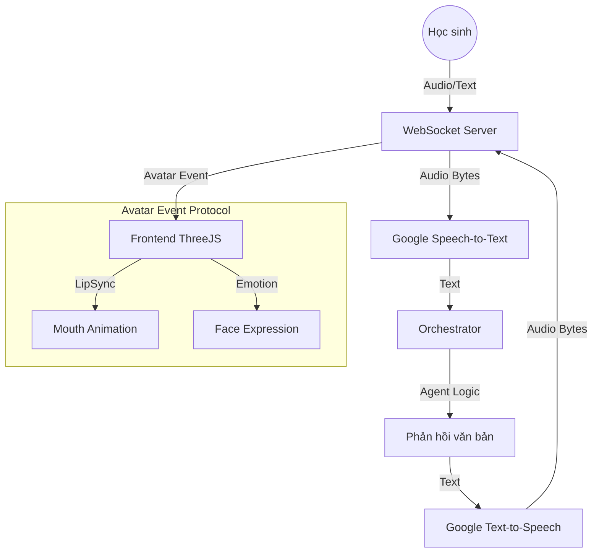

# Kiến trúc Voice & 3D Avatar (Giai đoạn 4)

Hệ thống NovaTutor AI hiện hỗ trợ tương tác giọng nói thời gian thực và điều khiển Avatar 3D thông qua WebSocket.

## 1. Luồng xử lý dữ liệu (Streaming Architecture)



## 2. Avatar Event Protocol

Dữ liệu gửi từ server đến client qua WebSocket có cấu trúc như sau:

```json
{
  "type": "avatar_event",
  "audio": "base64_encoded_audio",
  "lip_sync": [
    {"time": 0.1, "shape": "A"},
    {"time": 0.3, "shape": "O"}
  ],
  "emotion": "happy | confused | excited",
  "full_text": "Chào em, hôm nay chúng ta học gì nào?"
}
```

## 3. Cách sử dụng (Frontend Integration)

1. Kết nối đến `ws://localhost:8000/api/v1/ws/chat`.
2. Gửi tin nhắn dạng JSON: `{"text": "Hello"}` hoặc `{"audio": "base64_audio"}`.
3. Nhận sự kiện `text_chunk` để hiển thị chữ chạy thời gian thực.
4. Nhận sự kiện `avatar_event` để phát âm thanh và điều khiển Avatar 3D.

## 4. Triển khai Cloud Run (Scalability)

- Sử dụng **Session Affinity** trên Cloud Run để duy trì kết nối WebSocket.
- Đảm bảo tăng giới hạn bộ nhớ (Memory) nếu xử lý audio nặng.
- Cấu hình biến môi trường `GOOGLE_APPLICATION_CREDENTIALS` để sử dụng Speech/TTS APIs.
